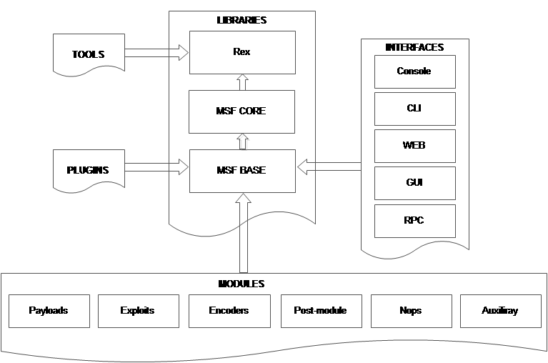
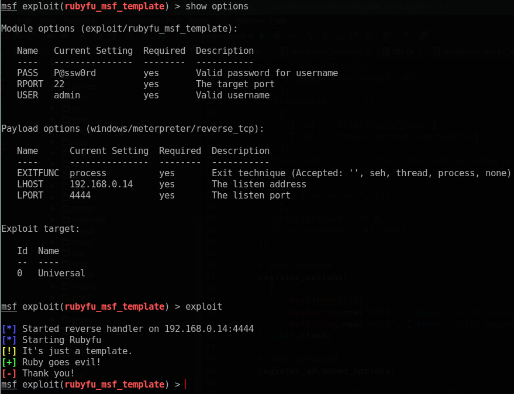

# Metasploit


## Metasploit Structure 

## Code Design Pattern 
Metasploit uses **Facades** design pattern which encapsulates/simplifies the complex part of the framework to preset it as interfaces and drivers which makes development really easy and elegant.
I found that the [wikipedia][1] example of facades is descent to be presented 

```ruby
# Complex Parts | Computer framework 
class CPU 
  def freeze; end
  def jump(position); end
  def execute; end
end

class Memory
  def load(position, data); end
end

class HardDrive
  def read(lba, size); end
end

# Facade | Interface
class ComputerFacade

  def initialize
    @processor = CPU.new
    @ram = Memory.new
    @hd  = HardDrive.new
  end

  def start
    @processor.freeze
    @ram.load(BOOT_ADDRESS, @hd.read(BOOT_SECTOR, SECTOR_SIZE))
    @processor.jump(BOOT_ADDRESS)
    @processor.execute
  end
end

# Client (The Developer want to use the complex computer frameword)
computer_facade = ComputerFacade.new
computer_facade.start
```

As you can see from the above code, the developer who want to user the **Computer framework** don't have to deal with all complex classes, methods and calculations directly. Instead, he will use a simple class interface called **`ComputerFacade`** which instantiate(as objects) all classes once you call it.





```bash
 mkdir -p $HOME/.msf4/modules/{auxiliary,exploits,post}
```


## Absolute module 

```ruby
##
# This module requires Metasploit: http://www.metasploit.com/download
# Current source: https://github.com/rapid7/metasploit-framework
##

require 'msf/core'

class Metasploit3 < Msf::Exploit::Remote

  Rank = ExcellentRanking
  def initialize(info = {})
    super(update_info(
      info,
      'Name'            => 'Absolute MSF template',
      'Description'     => %q{This is an absolute MSF template that shows how all modules look like},
      'License'         => MSF_LICENSE,
      'Author'          =>
        [
          'Ruby (@Rubyfu)',
          'Sabri (Sabri@Rubyfu.rb)'
        ],
      'References'      =>
        [
          ['URL', 'http://Rubyfu.net'],
          ['URL', 'https://github.com/Rubyfu']
        ],
      'Platform'        => %w{ linux win osx solaris unix bsd android aix},
      'Targets'         =>
        [
            ['Universal', {}]
        ],
      'DefaultTarget'  => 0,
      'DisclosureDate'  => '2015'
    ))

    # show options
    register_options(
      [
          Opt::RPORT(22),
          OptString.new('USER', [ true, 'Valid username', 'admin' ]),
          OptString.new('PASS', [ true, 'Valid password for username', 'P@ssw0rd' ]),
      ], self.class)

    # show advanced
    register_advanced_options(
      [
          OptInt.new('THREADS', [true, 'The number of concurrent threads', 5])
      ], self.class)
  end

  def exploit # or 'run' for post and auxiliary modules
    print_status('Starting Rubyfu')
    print_warning("It's just a template.")
    print_good('Ruby goes evil!')
    print_error("Thank you!")
  end

end

```

The result is




<!---
https://www.exploit-db.com/docs/27935.pdf

https://github.com/rapid7/metasploit-framework/wiki/Exploit-Ranking
https://github.com/rapid7/metasploit-framework/wiki
https://community.rapid7.com/thread/3126
https://github.com/rapid7/metasploit-framework/wiki/Creating-Metasploit-Framework-LoginScanners
-->


<!---

Rex library (Ruby extension Library)


-->

<!---
```ruby
require 'msf/core'

class Metasploit3 < Msf::Exploit::Remote
  Rank = NormalRanking

  def initialize(info={})
    super(update_info(info,
      'Name'           => "[Vendor] [Software] [Root Cause] [Vulnerability type]",
      'Description'    => %q{
        Say something that the user might need to know
      },
      'License'        => MSF_LICENSE,
      'Author'         => [ 'Name' ],
      'References'     =>
        [
          [ 'URL', '' ]
        ],
      'Platform'       => 'win',
      'Targets'        =>
        [
          [ 'System or software version', { 'Ret' => 0x41414141 } ]
        ],
      'Payload'        =>
        {
          'BadChars' => "\x00"
        },
      'Privileged'     => false,
      'DisclosureDate' => "",
      'DefaultTarget'  => 0))
  end

  def check
    # For the check command
  end

  def exploit
    # Main function
  end

end
```
-->


<br><br><br>
---
[1]: https://en.wikipedia.org/wiki/Facade_pattern#Ruby